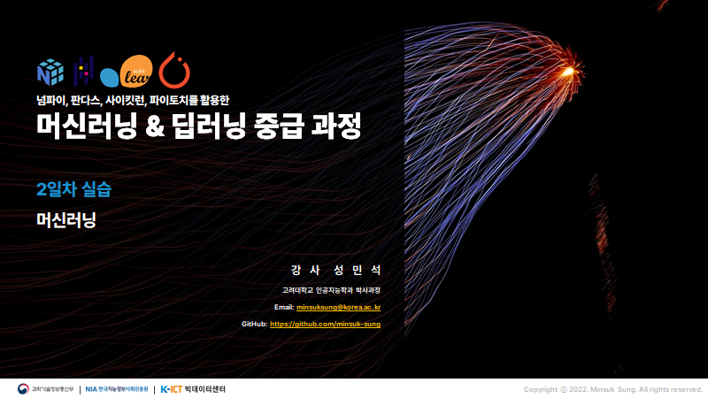
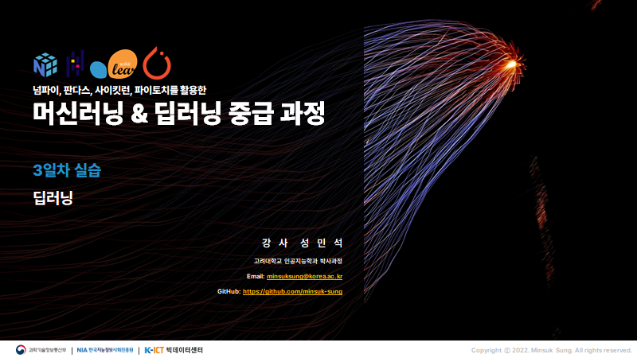

# 2022 K-ICT 빅데이터센터 딥러닝 초중급 과정
본 교육은 딥러닝 기초부터 중급까지를 모두 다룹니다. 판교 스타트업캠퍼스 1동 6층에 소재한 빅데이터센터 교육장에서 강의가 진행됩니다. 강의는 3일간, 오전 10시~오후 6시까지(총 21시간) 과정으로 진행되며, 이론과 실습과정으로 운영됩니다.

<br>

## 1. 수강 대상
본 강의는 인공지능과 머신러닝 그리고 딥러닝 관련하여 관심 있는 수강생을 대상으로 교육을 진행됩니다.    
> 본 강의는 파이썬에 대한 기초 지식이 없는 수강생에게는 다소 어려울 수 있습니다. 이 점 양해 부탁드립니다.

<br>

## 2. 교육 일시 및 장소
본 강의는 `2022.8.31(수)~9.2(금)`으로 `3일간` 진행됩니다. 각 일자별로 `오전 10시 ~ 오후 6시까지(총 21시간)`로 진행됩니다. 본 교육은 [판교 스타트업캠퍼스 1동 6층](http://kko.to/ZorLrT4fH)에 소재한 빅데이터센터 교육장에서 강의(온라인)가 진행됩니다. 

<br>

<div align='center'><div style="font:normal normal 400 12px/normal dotum, sans-serif; width:640px; height:392px; color:#333; position:relative"><div style="height: 360px;"><a href="https://map.kakao.com/?urlX=523421.0&amp;urlY=1084809.0&amp;name=%EA%B2%BD%EA%B8%B0%20%EC%84%B1%EB%82%A8%EC%8B%9C%20%EB%B6%84%EB%8B%B9%EA%B5%AC%20%ED%8C%90%EA%B5%90%EB%A1%9C289%EB%B2%88%EA%B8%B8%2020&amp;map_type=TYPE_MAP&amp;from=roughmap" target="_blank"></a></div></div></div>

<br>

## 3. 강의 세부 안내
본 강의는 파이썬에 대한 기초 지식과 머신러닝과 딥러닝에 대한 전반적인 이론과 마지막으로 이론에 대한 실습으로 운영됩니다. 본 강의 자료 및 실습 자료를 [한꺼번에 다운](https://github.com/minsuk-sung/2022-NIA-Deep-Learning-Lecture/archive/refs/heads/main.zip)받기 위해선 아래 그림과 같이 [Download ZIP](https://github.com/minsuk-sung/2022-NIA-Deep-Learning-Lecture/archive/refs/heads/main.zip)을 눌러주시길 바랍니다.

<br>

### 실습환경
본 강의의 실습시간을 위해서 아래와 같은 라이브러리 버전을 맞춰주셔야 원할한 실습이 진행됩니다. 주피터 노트북(Jupyter Notebook)의 설치가 힘들 경우에는 구글 콜랩(Google Colab) 환경에서 실습을 진행해주시길 바랍니다.

<br>
<div align='center'>
<!-- https://naereen.github.io/badges/ -->


</div>
<br>

아나콘다(Anaconda)를 이용하여 가상환경을 생성할 경우 아래와 같은 명령어를 한줄 한줄씩 실행해주세요.
```
>> (base) conda create -n k-ict python=3.7 -y
>> (base) conda activate k-ict
>> (k-ict) conda install -c anaconda jupyter
>> (k-ict) conda install numpy==1.20.2
>> (k-ict) conda install pandas==1.2.3
>> (k-ict) conda install matplotlib==3.3.4
>> (k-ict) conda install scikit-learn==0.24.2
```

<br>

### 1일차 교육 - 8/31(수)
오전 시간에는 파이썬 기본 자료형과 조건문 및 반복문 그리고 함수와 클래스에 대해서 간략하게 복습합니다. 그리고 오후 시간에는 파이썬에서 데이터 분석을 할 때 가장 많이 활용되는 라이브러리들을 소개합니다. 


||실습 파일|실습 내용| 
|---|---|---|
|1|[파이썬(Python)](https://github.com/minsuk-sung/2022-NIA-Deep-Learning-Lecture/blob/main/code/1%EC%9D%BC%EC%B0%A8%20%EC%8B%A4%EC%8A%B5(1)%20-%20%ED%8C%8C%EC%9D%B4%EC%8D%AC(Python).ipynb)|파이썬 기초 개념 복습|
|2|[넘파이(NumPy)](https://github.com/minsuk-sung/2022-NIA-Deep-Learning-Lecture/blob/main/code/1%EC%9D%BC%EC%B0%A8%20%EC%8B%A4%EC%8A%B5(2)%20-%20%EB%84%98%ED%8C%8C%EC%9D%B4(NumPy).ipynb)|넘파이의 기초와 활용|
|3|[판다스(Pandas)](https://github.com/minsuk-sung/2022-NIA-Deep-Learning-Lecture/blob/main/code/1%EC%9D%BC%EC%B0%A8%20%EC%8B%A4%EC%8A%B5(3)%20-%20%ED%8C%90%EB%8B%A4%EC%8A%A4(Pandas).ipynb)|판다스의 기초와 활용|
|4|[맷플랏립(Matplotlib)](https://github.com/minsuk-sung/2022-NIA-Deep-Learning-Lecture/blob/main/code/1%EC%9D%BC%EC%B0%A8%20%EC%8B%A4%EC%8A%B5(4)%20-%20%EB%A7%B7%ED%94%8C%EB%9E%8F%EB%A6%BD(Matplotlib).ipynb)|맷플랏립과 시본의 간단한 활용 예제|
|5|[사이킷런(Scikit-Learn)](https://github.com/minsuk-sung/2022-NIA-Deep-Learning-Lecture/blob/main/code/1%EC%9D%BC%EC%B0%A8%20%EC%8B%A4%EC%8A%B5(5)%20-%20%EC%82%AC%EC%9D%B4%ED%82%B7%EB%9F%B0(Scikit-Learn).ipynb)|타이타닉 데이터셋을 통해 알아보는 사이킷런|

<br>

### 2일차 교육 - 9/1(목)
오전 시간에는 머신러닝에 대한 기초 이론과 개념에 대해서 배웁니다. 오후 시간에는 머신러닝 모델 위주로 실습을 진행하며 여러 가지 데이터셋에 대해서 실습을 진행합니다.




||실습 파일|실습 내용| 
|---|---|---|
|1|[나이브 베이즈(Naive bayes)와 서포트 벡터 머신(SVM)](https://github.com/minsuk-sung/2022-NIA-Deep-Learning-Lecture/blob/main/code/2%EC%9D%BC%EC%B0%A8%20%EC%8B%A4%EC%8A%B5(1)%20-%20%EB%82%98%EC%9D%B4%EB%B8%8C%20%EB%B2%A0%EC%9D%B4%EC%A6%88(Naive%20bayes)%EC%99%80%20%EC%84%9C%ED%8F%AC%ED%8A%B8%20%EB%B2%A1%ED%84%B0%20%EB%A8%B8%EC%8B%A0(SVM).ipynb)|나이브 베이즈와 서포트 벡터 머신 알고리즘을 활용한 아이리스 붓꽃 데이터셋 분석 예제|
|2|[의사결정 나무(Decision Tree)](https://github.com/minsuk-sung/2022-NIA-Deep-Learning-Lecture/blob/main/code/2%EC%9D%BC%EC%B0%A8%20%EC%8B%A4%EC%8A%B5(2)%20-%20%EC%9D%98%EC%82%AC%EA%B2%B0%EC%A0%95%20%EB%82%98%EB%AC%B4(Decision%20Tree).ipynb)|의사결정 나무 모델을 활용한 와인 품질 데이터셋 분석 예제|
|3|[배깅(Bagging)](https://github.com/minsuk-sung/2022-NIA-Deep-Learning-Lecture/blob/main/code/2%EC%9D%BC%EC%B0%A8%20%EC%8B%A4%EC%8A%B5(3)%20-%20%EB%B0%B0%EA%B9%85(Bagging).ipynb)|랜덤 포레스트 모델을 활용한 자전거 수요 예측 데이터셋 분석 예제|
|4|[부스팅(Boosting)](https://github.com/minsuk-sung/2022-NIA-Deep-Learning-Lecture/blob/main/code/2%EC%9D%BC%EC%B0%A8%20%EC%8B%A4%EC%8A%B5(4)%20-%20%EB%B6%80%EC%8A%A4%ED%8C%85(Boosting).ipynb)|XGBoost 모델을 활용한 타이타닉 데이터셋 분석 예제|

<br>

### 3일차 교육 - 9/2(금)
오전 시간에는 딥러닝에 대한 기초 이론과 개념에 대해서 배웁니다. 오후 시간에는 합성곱 신경망이나 순환 신경망의 기본 개념과 이에 대한 실습을 진행합니다.




||실습 파일|실습 내용| 
|---|---|---|
|1|[파이토치(PyTorch)](https://github.com/minsuk-sung/2022-NIA-Deep-Learning-Lecture/blob/main/code/3%EC%9D%BC%EC%B0%A8%20%EC%8B%A4%EC%8A%B5(1)%20-%20%ED%8C%8C%EC%9D%B4%ED%86%A0%EC%B9%98(PyTorch).ipynb)|파이토치 기본 문법과 활용 예제|
|2|[파이토치로 선형 회귀 모델 구현하기](https://github.com/minsuk-sung/2022-NIA-Deep-Learning-Lecture/blob/main/code/3%EC%9D%BC%EC%B0%A8%20%EC%8B%A4%EC%8A%B5(2)%20-%20%ED%8C%8C%EC%9D%B4%ED%86%A0%EC%B9%98%EB%A1%9C%20%EC%84%A0%ED%98%95%20%ED%9A%8C%EA%B7%80%20%EB%AA%A8%EB%8D%B8%20%EA%B5%AC%ED%98%84%ED%95%98%EA%B8%B0.ipynb)|파이토치로 선형 회귀 모델 구현하기|
|3|[합성곱 신경망(CNN)](https://github.com/minsuk-sung/2022-NIA-Deep-Learning-Lecture/blob/main/code/3%EC%9D%BC%EC%B0%A8%20%EC%8B%A4%EC%8A%B5(3)%20-%20%ED%95%A9%EC%84%B1%EA%B3%B1%20%EC%8B%A0%EA%B2%BD%EB%A7%9D(CNN).ipynb)|간단한 CNN모델을 활용한 MNIST 손글씨 데이터셋 예제|
|4|[순환 신경망(RNN)](https://github.com/minsuk-sung/2022-NIA-Deep-Learning-Lecture/blob/main/code/3%EC%9D%BC%EC%B0%A8%20%EC%8B%A4%EC%8A%B5(4)%20-%20%EC%88%9C%ED%99%98%20%EC%8B%A0%EA%B2%BD%EB%A7%9D(RNN).ipynb)|LSTM을 활용한 국내 주식 데이터 모델링 예제|

<br>

## 4. 질의응답
본 강의와 관련된 질문은 강사의 [오픈 카카오톡 프로필](https://open.kakao.com/me/minsuksung)이나 `이메일`을 통해서 부탁드리겠습니다. 

<div align='center'><a href="https://open.kakao.com/me/minsuksung"></a></div>

<br>

## 5. 라이센스


The class is licensed under the [MIT License](http://opensource.org/licenses/MIT):

Copyright (c) 2022. Minsuk Sung. All rights reserved.

Permission is hereby granted, free of charge, to any person obtaining a copy of this software and associated documentation files (the "Software"), to deal in the Software without restriction, including without limitation the rights to use, copy, modify, merge, publish, distribute, sublicense, and/or sell copies of the Software, and to permit persons to whom the Software is furnished to do so, subject to the following conditions:

The above copyright notice and this permission notice shall be included in all copies or substantial portions of the Software.

THE SOFTWARE IS PROVIDED "AS IS", WITHOUT WARRANTY OF ANY KIND, EXPRESS OR IMPLIED, INCLUDING BUT NOT LIMITED TO THE WARRANTIES OF MERCHANTABILITY, FITNESS FOR A PARTICULAR PURPOSE AND NONINFRINGEMENT. IN NO EVENT SHALL THE AUTHORS OR COPYRIGHT HOLDERS BE LIABLE FOR ANY CLAIM, DAMAGES OR OTHER LIABILITY, WHETHER IN AN ACTION OF CONTRACT, TORT OR OTHERWISE, ARISING FROM, OUT OF OR IN CONNECTION WITH THE SOFTWARE OR THE USE OR OTHER DEALINGS IN THE SOFTWARE.
